# Concurrency
[English](/go-tutorial/concurrency) | [Türkçe](/go-tutorial/tr/concurrency)

In computer science, concurrency is the ability to run workpieces sequentially 
in a way that does not affect the final result.

The ability to run the workpieces independently allows us to use the processor at maximum efficiency 
by executing the instructions in different cores.


## Goroutines

Goroutines are functions in a task queue that waits to be executed by a system thread.
To create a goroutine, we only need to write `go` when running the function.

In the application below, every time the Work function is called it blocks the application until it is finished.


```go
func Work(msg string) {
	fmt.Println(msg)
	time.Sleep(time.Second * 2)
}

func main() {
	Work("work work work work work work...")
	Work("zxcasfv")
}
```

Let's run the blocking parts as goroutine.

```go
func main() {
	go Work("work work work work work work...")
	go Work("zxcasfv")
}
```
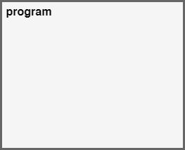

When we run the program, it will end without printing anything on the screen. 
This is because after the function `main` finishes the program exits without waiting `Work` function to write on the screen. 
 
We can capture the output of `Work` function by adding a small delay at the end of the main function,

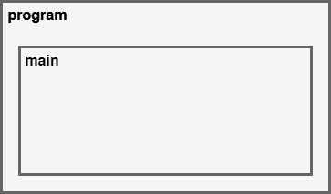

```go
package main

import (
	"fmt"
	"time"
)

func Work(msg string) {
	fmt.Println(msg)
	time.Sleep(time.Second * 2)
}

func main() {
	go Work("work work work work work work...")
	go Work("zxcasfv")
	time.Sleep(time.Second * 3)
}

```

## WaitGroup

In some cases, we may need the to wait for a number of goroutines to finish at a certain moment of the runtime.

With WaitGroup, we can specify the number of goroutines we want wait for and after the individual goroutine finishes its job it can call WaitGroup's `Done()` method to notify the waitgroup.

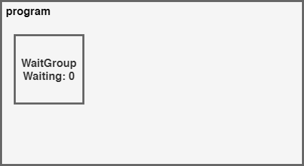

```go
func Work(msg string, wg *sync.WaitGroup) {
	time.Sleep(time.Second * 2)
	fmt.Println(msg)
	wg.Done()
}

func main() {
	nWorkers := 5
	wg := &sync.WaitGroup{}
	wg.Add(nWorkers)

	for i := 0; i < nWorkers; i++ {
		go Work("work", wg)
	}

	wg.Wait()
}

```

## Channels

Channels allows us to communicate goroutines with each other.

In the above example, we cannot get the return value from the functions if we run them as goroutines. 
We can create a channel to send the result of a goroutine to the main function or to anoter goroutine.

Channels can be created as `make(chan data_type, buffer)`.

We can send data to channel using the `channel <- data` and wait data from channel using the  `data := <- channel` signature. 

Both these operations block the runtime until they finish.

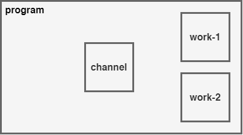

```go
func Work(msg string, ch chan string) {
	time.Sleep(time.Second * 2)
	ch <- msg
}

func main() {
	channel := make(chan string)
	go Work("work-1", channel)
	go Work("work-2", channel)

	for i := 0; i < 2; i++ {
		msg := <-channel
		fmt.Println(msg)
	}
}
```

## Mutex

Mutexes are the concurrency primitives that allows goroutines to change the value of a shared variable without causing a race condition.

!!! quote "Wikipedia Definition"
	In computer science, mutual exclusion is a property of concurrency control, which is instituted for the purpose of preventing race conditions. It is the requirement that one thread of execution never enters its critical section at the same time that another concurrent thread of execution enters its own critical section, which refers to an interval of time during which a thread of execution accesses a shared resource, such as shared memory.

In the example below we use a Counter to count the user clicks.

```go

type  Counter struct {
	Value int
}

func (c *Counter) Inc() {
	c.Value++
}


func Click(c *Counter, wg *sync.WaitGroup) {
	c.Inc()
	wg.Done()
}

func main() {

	nUsers := 500
	wg := &sync.WaitGroup{}
	wg.Add(nUsers)

	counter := &Counter{}

	for i := 0; i < nUsers; i++ {
		go Click(counter, wg)
	}

	wg.Wait()
	fmt.Println(counter.Value)

}
```

At first glance, our program does not look suspicous but if we build the
program with the **--race** flag and run; it will show us that we have a race condition here.

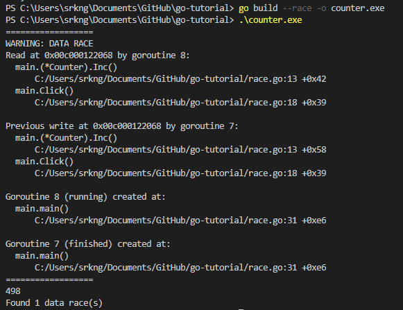


What happens is that if we have a machine with multiple cores it can execute the `Click` function calls
at the same time and program gets confused about the new `c.Value`.


Now, lets fix this problem by defining a mutex in `main` and
using the `mx.Lock` and `mx.Unlock` methods within the `Click` function.

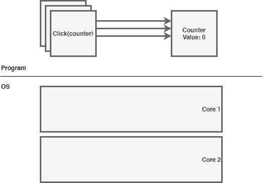

```go


func Click(c *Counter, wg *sync.WaitGroup, mx *sync.Mutex) {
	mx.Lock()
	c.Inc()
	mx.Unlock()
	wg.Done()
}

func main() {

	nUsers := 500
	wg := &sync.WaitGroup{}
	wg.Add(nUsers)

	mx := &sync.Mutex{}
	counter := &Counter{}

	for i := 0; i < nUsers; i++ {
		go Click(counter, wg, mx)
	}

	wg.Wait()
	fmt.Println(counter.Value)

}
```

It is also common to define mutex in structs. As we can see below,
we have defined the `*sync.Mutex` as a promoted field in `Counter`
and used the `c.Lock` and `c.Unlock` methods to protect the counter value.

```go
type  Counter struct {
	Value int
	*sync.Mutex
}

func (c *Counter) Inc() {
	c.Value++
}


func Click(c *Counter, wg *sync.WaitGroup) {
	c.Lock()
	c.Inc()
	c.Unlock()
	wg.Done()
}

func main() {

	nUsers := 500
	wg := &sync.WaitGroup{}
	wg.Add(nUsers)

	counter := &Counter{Mutex: &sync.Mutex{}}

	for i := 0; i < nUsers; i++ {
		go Click(counter, wg)
	}

	wg.Wait()
	fmt.Println(counter.Value)

}
```


## Select

Sending data to channels or waiting for data from channels blocks the application.

Select allows us to await data from multiple channels at the same time.

In the example below, two goroutines continuously sending data to `chan1` and `chan2`.

We can read all incoming messages from both channels by selecting both of them inside an infinite loop. When a message comes from any of the channels, select statement will enter into the corresponding case and handle the message. After the case ends for loop will start the selection process again.

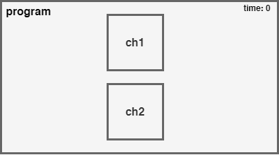

```go
func Work(ch1 chan string, ch2 chan string) {

	// Send data to ch1 every second
	go func() {
		for {
			time.Sleep(1 * time.Second)
			ch1 <- "work-1"
		}
	}()

	// Send data to ch2 every 1.5 seconds
	go func() {
		for {
			time.Sleep(1.5 * time.Second)
			ch2 <- "work-2"
		}
	}()

}

func main() {
	ch1 := make(chan string)
	ch2 := make(chan string)

	go Work(ch1, ch2)

	for {
		select {
		case msg1 := <-ch1:
			fmt.Println(msg1)
		case msg2 := <-ch2:
			fmt.Println(msg2)
		}
	}

}

```

### Adding Timeout

A program like above will be blocked if both channels does not receive any message. We can add timeouts to prevent this to happen.

We can break the loop by waiting from a signal from another **finite channel** and then break the loop when it is triggered.

Go has predefined channels for this kind of purposes. Time module has the `time.After` function which sends a signal **after** a certain delay.   

```go
func main() {
	ch1 := make(chan string)
	ch2 := make(chan string)

	go Work(ch1, ch2)

	for {
		select {
		case msg1 := <-ch1:
			fmt.Println(msg1)
		case msg2 := <-ch2:
			fmt.Println(msg2)
		case <-time.After(time.Second * 1):
			fmt.Println("🎵 Brave Sir Robin ran away 🎵")
			fmt.Println("🎵 Bravely ran away away    🎵")
				return
		}

	}
```


## Context

"We use Context to inform goroutines about cancellations and timeouts."

Context deserve atleast the same amout of learning effort as the other concurrency units. 

Spawning goroutines all around without caring much about their status can significanly effect the performance without any obvious errors.

When we spawn a goroutine using `go Func()`, it does not give us a reference
to later cancel it.

We sometimes spawn resource intensive goroutines using another goroutines. When the spawner goroutine finishes other goroutine keeps running in background even it is not necessary. Our resoures gets wasted.

Uncool..

This is where the Context comes handy.

- Context allows us to propagate cancellation across goroutines.
- We can create context hierarchies. When the parent context gets cancelled all child contexts also cancels.

Without Context                         |  With Context
:--------------------------------------:|:-------------------------:
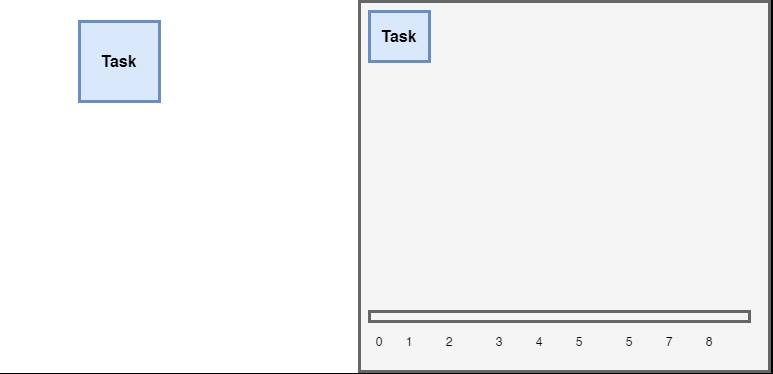  | 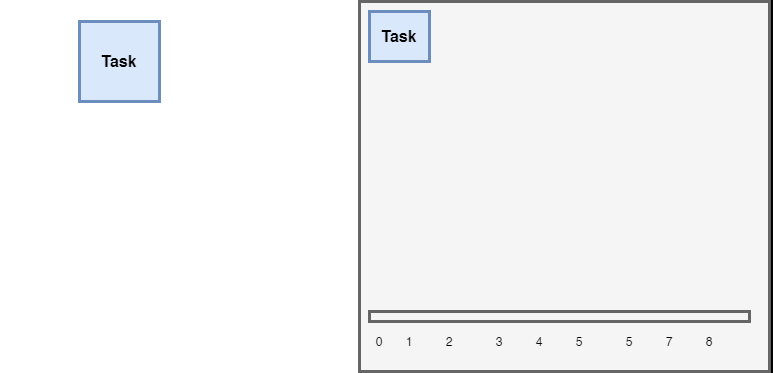


### Implementation

GO provides all these stuff under the `context` package.

The package has the `context.Context` interface that defines 4 methods.

```go
type Context interface {
	Deadline() (deadline time.Time, ok bool)
	Done() <-chan struct{}
	Err() error
	Value(key interface{}) interface{}
}
```

`Deadline()` method returns the deadline for the work to be completed. Using this; we can dich a long running task if it has not enough time to finish anyway.

`Done()` returns a channel that gets closed **after the work is completed** or the **context gets cancelled**.

`Err()` returns an error that explains the reason why the context ended. It can be either `Canceled` or `DeadlineExceeded`.

`Value` returns the value of given key. As the parent context data is shared through the hierarchy, same key will always return the same value. 

!!! warning 
	Using this mechanic to deliver data accross tasks and hierarchies is a **bad idea** since the key and the value does not have any type checking.

The context package provides functions to create types that implements the `Context` interface for various purpouses. These functions are:

- `context.Background()` that returns the root context. The background context does not contain any logic in it. All the other contexts are the children of the background context.

- `context.TODO()` that is basically same as `context.Background()` but we use this as a placeholder when we are not sure about the context type we are going to use.

The package also provides some functions that wraps the parent context and add some cancellation logic to it. 

All these functions excepts a **parent context** and they all returns the **wrapped context** and a function to `cancel` the context manually. They send a signal to `Done()` channel when their criteria is meth.


- `context.WithCancel(parent)` is used to cancel the context manually. It does not contain a timeout or deadline logic.

In the example below we create a background task and wrap it with `context.WithCancel`.

Then we spawn 2 `SendRequest` goroutines and share the context with them
and we spawn another goroutine that triggers the `cancel` function after 1 second.

Notice how all functions passes the context to other and wait for the context to be done using the  `<- ctx.Done()` statement.

When the `cancel` function gets triggered it will notify all of the tasks by sending a signal to the ` ctx.Done()` channel.

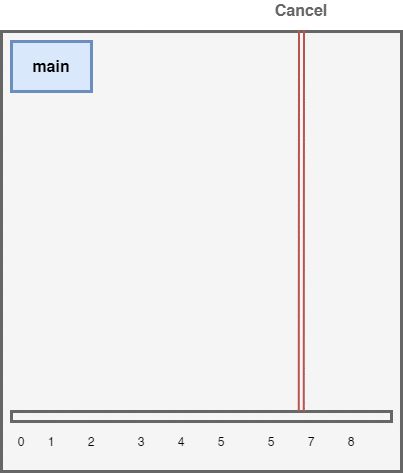

```go
// SearchDB finishes normally after 2 seconds
func SearchDB(ctx context.Context){
	fmt.Println("Searching Database")
	select {
	case <- ctx.Done():
		fmt.Println("Search Cancelled")
	case <- time.After(time.Second * 2):
		fmt.Println("Search Finished")
	}

}
// SendRequest finishes normally after 2 seconds
func SendRequest(ctx context.Context){
	fmt.Println("Processing Request")
	
	go SearchDB(ctx)
	go SearchDB(ctx)
	
	select {
	case <- ctx.Done():
		fmt.Println("Request Cancelled")
	case <- time.After(time.Second * 2):
		fmt.Println("Request Finished")
	}
}


func main() {
	ctx := context.Background()
	cancellingCtx, cancel := context.WithCancel(ctx)
	
	go SendRequest(cancellingCtx)
	go SendRequest(cancellingCtx)

	// This will manually cancel all request and database searches after 1 second
	go time.AfterFunc(time.Second, cancel)

	select {
	case <- cancellingCtx.Done():
		fmt.Println("Cancelled by Context")
	case <- time.After(time.Second * 3):
		fmt.Println("Finished normally")
	}

	// This will give time to goroutines to print stuff on screen
	<- time.After(time.Second * 3)
}
```

- `context.WithTimeout(parent, duration)` is used to set a certain time limit. 

We can also add a new timeout to existing context. For this example; we can add another timeout in `SendRequest` function. So that if the database does not return within 2 seconds we can cancel it.

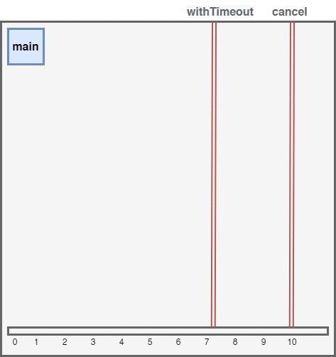


```go
// SendRequest finishes normally after 5 seconds
// Cancels database search after waiting for 2 seconds
func SendRequest(ctx context.Context){
	fmt.Println("Processing Request")
	
	// This will cancel all database searches after 2 seconds
	// We will not use the cancel function since we already set a timeout
	dbCtx, _ := context.WithTimeout(ctx, time.Second * 2)

	go SearchDB(dbCtx)
	go SearchDB(dbCtx)
	
	select {
	case <- ctx.Done():
		fmt.Println("Request Cancelled")
	case <- dbCtx.Done():
		fmt.Println("Search Timeout -", dbCtx.Err())  // Search Timeout - context deadline exceeded
	case <- time.After(time.Second * 5):
		fmt.Println("Request Finished")
	}
}

```

-  `context.WithDeadline(parent, time)` is used to when you want context to be cancelled on a specific time.


## Example

A group of workers is working in a iron and coal mine deposit, where ores are explored, mined and processed.

In the application below, we can see how workers can work in parallel with the concurrency tools provided by the go language.


```go
package main

import (
	"fmt"
	"strconv"
	"sync"
	"time"
)

// Vein holds and yields ores
type Vein struct {
	Ores []string
}

// Reveal shows the next ore in the mine
func (vein *Vein) Reveal() (ore string) {
	if len(vein.Ores) == 0 {
		return
	}
	ore = vein.Ores[0]
	vein.Ores = vein.Ores[1:]
	return ore
}

// Worker can explore veins, mines or processes ores.
type Worker struct {
	name string
}

// Find sends the next found ore in the mine to the miner channel
func (w *Worker) Find(vein *Vein, ch chan<- string) {
	ore := vein.Reveal()
	if ore != "" {
		fmt.Println(w.name, "found", ore)
		time.Sleep(time.Second * 2)

		ch <- ore
	}

}

// Mine extracts the found ore and sends it to smelting channel
func (w *Worker) Mine(finder <-chan string, smelter chan<- string) {
	for ore := range finder {
		fmt.Println(w.name, "mining", ore)
		time.Sleep(time.Second * 1)
		smelter <- ore
	}
}

// Smelt melts or processes the ore
func (w *Worker) Smelt(coal_miner, iron_miner <-chan string, wg *sync.WaitGroup) {
	for {
		select {
		case coal_ore := <-coal_miner:
			time.Sleep(time.Second * 1)
			fmt.Println(w.name, "processed", coal_ore)
		case iron_ore := <-iron_miner:
			time.Sleep(time.Second * 2)
			fmt.Println(w.name, "smelted", iron_ore)
		}
		wg.Done()
	}
}

func main() {
	wg := &sync.WaitGroup{}

	// Create a Iron Vein with 100 ores in it
	n_iron_ores := 100
	iron_vein := &Vein{make([]string, n_iron_ores)}
	for i := range iron_vein.Ores {
		iron_vein.Ores[i] = "iron-ore-" + strconv.Itoa(i)
	}

	// Create a Coal Vein with 50 ores in it
	n_coal_ores := 50
	coal_vein := &Vein{make([]string, n_coal_ores)}
	for i := range coal_vein.Ores {
		coal_vein.Ores[i] = "coal-ore-" + strconv.Itoa(i)
	}

	// Create ore delivery channel between workers
	finder_to_miner := make(chan string)
	coal_miner_to_smelter := make(chan string)
	iron_miner_to_smelter := make(chan string)

	// Create ore explorers
	n_finders := 6
	finders := make([]*Worker, n_finders)
	for i := range finders {
		finders[i] = &Worker{
			name: "finder-" + strconv.Itoa(i),
		}
	}

	// Create ore miners
	n_miners := 50
	miners := make([]*Worker, n_miners)
	for i := range miners {
		miners[i] = &Worker{
			name: "miner-" + strconv.Itoa(i),
		}
	}

	// Create ore smelters
	n_smelters := 10
	smelters := make([]*Worker, n_smelters)
	for i := range smelters {
		smelters[i] = &Worker{
			name: "smelter-" + strconv.Itoa(i),
		}
	}

	// Send half of the explorers to find ores in coal vein
	// and other half to iron vein
	for i := 0; i < n_iron_ores+n_coal_ores; i++ {

		wg.Add(1)
		finder_idx := i % len(finders)

		go finders[finder_idx].Find(coal_vein, finder_to_miner)
		go finders[finder_idx].Find(iron_vein, finder_to_miner)
	}

	// Assing half of the miners to mine iron ores and the other half to coal
	for i, miner := range miners {

		if i%2 == 0 {
			go miner.Mine(finder_to_miner, iron_miner_to_smelter)
		} else {
			go miner.Mine(finder_to_miner, coal_miner_to_smelter)
		}

	}

	// Start working the smelters
	for _, smelter := range smelters {
		go smelter.Smelt(coal_miner_to_smelter, iron_miner_to_smelter, wg)
	}

	// Wait for all ores to be found, mined and smelted
	wg.Wait()

}

```
