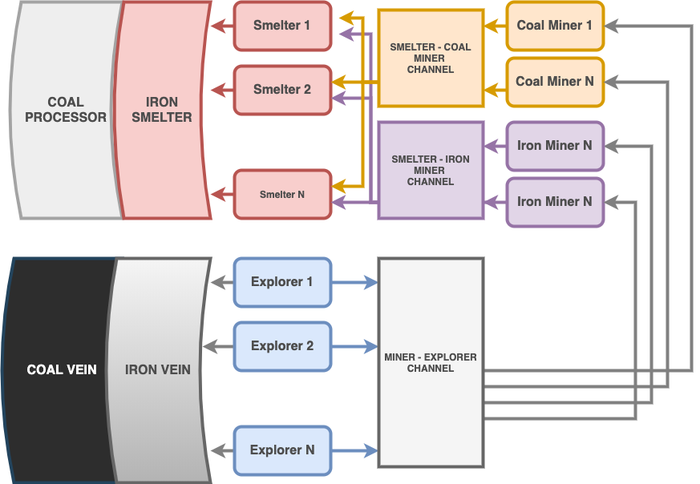

# Concurrency
[English](/go-tutorial/concurrency) | [Türkçe](/go-tutorial/tr/concurrency)

Bilgisayar biliminde concurrency\(eşzamanlılık\), bir programdaki iş birimlerinin veya algoritmaların sonucu etkilemeyecek şekilde **sırasız** bir biçimde çalıştırılabilmesidir.

İş parçalarını birbirinden bağımsız çalıştırabilmemiz, süreçleri farklı çekirdeklerde yürüterek, işlemciyi maksimum verimde kullanmamızı sağlar.

GO dilinde concurrency goroutineler ile sağlanır.

## Goroutines

GO routineler boyutları küçük threadler olarak düşünülebilir. Goroutine oluşturmak için sadece fonksiyonu çalıştırırken başına `go` yazmamız yeterli.

Aşağıdaki uygulamada Work fonksiyonu her çağrıldığında, çalışması bitene kadar uygulamayı blokluyor.

```go
func Work(msg string) {
	fmt.Println(msg)
	time.Sleep(time.Second * 2)
}

func main() {
	Work("work work work work work work...")
	Work("zxcasfv")
}
```

Bloklayan kısımları goroutine olarak çalıştıralım.

```go
func main() {
	go Work("work work work work work work...")
	go Work("zxcasfv")
}
```

Programı çalıştırdığımızda ekrana hiçbir şey yazdırmadan sonlanacak. `main`fonksiyonu, `Work` fonksiyonu henüz ekrana bir şeyler yazacak kadar çalışmadan, bitiyor ve program kapanıyor. Ufak bir hile ile `Work` fonksiyonunun çıktısını alabiliriz.

```go
package main

import (
	"fmt"
	"time"
)

func Work(msg string) {
	fmt.Println(msg)
	time.Sleep(time.Second * 2)
}

func main() {
	go Work("work work work work work work...")
	go Work("zxcasfv")
	time.Sleep(time.Second * 1)
}

```

### waitGroup

Uygulamanın belli anlarında bazı goroutinelerin bitmesini beklememiz gerekebilir.

WaitGroup ile kaç tane gorouitne çalışacağını öncesinde girip sonrasında işlerini bitirmelerini bekleyebiliriz. Goroutinelerin burada tek yapması gereken, işi bittiğinde WaitGroup'un Done methodunu çalıştırması.

```go
func Work(msg string, wg *sync.WaitGroup) {
	time.Sleep(time.Second * 2)
	fmt.Println(msg)
	wg.Done()
}

func main() {
	nWorkers1, nWorkers2 := 5, 4
	wg := &sync.WaitGroup{}
	wg.Add(nWorkers1)

	for i := 0; i < nWorkers1; i++ {
		go Work("work-1", wg)
	}

	wg.Wait()

	wg.Add(nWorkers2)

	for i := 0; i < nWorkers2; i++ {
		go Work("work-2", wg)
	
	wg.Wait()
}

```

## Channels

Channeller goroutinelerin birbirleri ile haberleşmesini sağlar.

Yukarıdaki örnekte `go` ile çalıştırdığımız fonksiyonlardan dönüş değeri alamıyoruz. Channellar ile goroutinin sonucu ana fonksiyona veya başka bir goroutine göndermesini sağlayabiliriz.

channeller `make(chan veritipi, buffer)` şeklinde oluşturulabilir.

```go
func Work(msg string, ch chan string) {
	ch <- msg
	time.Sleep(time.Second * 2)
}

func main() {
	ch1 := make(chan string)
	go Work("work-1", ch1)
	go Work("work-2", ch1)

	for i := 0; i < 2; i++ {
		msg := <-ch1
		fmt.Println(msg)
	}
}
```

## Mutex

> **Wikipedia Tanımı**
>
> In computer science, mutual exclusion is a property of concurrency control, which is instituted for the purpose of preventing race conditions. It is the requirement that one thread of execution never enters its critical section at the same time that another concurrent thread of execution enters its own critical section, which refers to an interval of time during which a thread of execution accesses a shared resource, such as shared memory.

```go

func Click(counter *int, wg *sync.WaitGroup) {
	*counter += 1
	wg.Done()
}

func main() {

	counter := 0

	nUsers := 500
	wg := &sync.WaitGroup{}
	wg.Add(nUsers)

	for i := 0; i < nUsers; i++ {
		go Click(&counter, wg)
	}

	wg.Wait()
	fmt.Println(counter)

}

```


```go

func Click(counter *int, wg *sync.WaitGroup, mx *sync.Mutex) {
	mx.Lock()
	*counter += 1
	mx.Unlock()

	wg.Done()
}

func main() {

	counter := 0

	mx := &sync.Mutex{}

	nUsers := 500
	wg := &sync.WaitGroup{}
	wg.Add(nUsers)

	for i := 0; i < nUsers; i++ {
		go Click(&counter, wg, mx)
	}

	wg.Wait()

	fmt.Println(counter)
}

```


## Select
Kanallara veri göndermek veya kanallardan veri beklemek uygulamayı bloklar. 
Select aynı anda birkaç tane kanalı beklememize olanak sağlar.

Aşağıdaki örnekte 2 goroutine `chan1` ve `chan2` kanallarına sürekli veri gönderiyor.
İki kanaldan da gelen tüm verileri sonsuz bir döngü içindeki select yapısı ile alabiliriz.
Herhangi bir kanaldan mesaj geldiğinde select o kanalı bekleyen `case`e girecek ve
içinde tanımlanan işlemler bittikten sonra döngü kanal bekleme işlemini tekrarlayacaktır.

```go
chan1 := make(chan string)
chan2 := make(chan string)

go func() {
	for {
		time.Sleep(2 * time.Second)
		chan1 <- "one"
	}
}()
go func() {
	for {
		time.Sleep(1 * time.Second)
		chan2 <- "two"
	}
}()

for {
	select {
	case msg1 := <-chan1:
		fmt.Println(msg1)
	case msg2 := <-chan2:
		fmt.Println( msg2)
	}
}
```

### Zaman Aşımı

Yukarıdaki gibi bir program 2 channela da veri gönderilmezse kilitlenecektir. 
Bu sonsuz döngüyü başka bir channelı bekleyerek kırabiliriz. 

Go, bu tür bir amaç için önceden tanımlanmış yapılara sahiptir. 
Time modülündeki `time.After` metodunu bellirlediğimiz bir süreden sonra bir channelı tetiklemek için kullanabiliriz.

```go
chan1 := make(chan string)
chan2 := make(chan string)

go func() {
	for {
		time.Sleep(1 * time.Second)
		chan1 <- "one"
	}
}()
go func() {
	for {
		time.Sleep(2 * time.Second)
		chan2 <- "two"
	}
}()

for {
	select {
	case msg1 := <-chan1:
		fmt.Println(msg1)
	case msg2 := <-chan2:
		fmt.Println(msg2)
	case <-time.After(time.Second * 1):
		fmt.Println("🎵 Brave Sir Robin ran away 🎵")
        fmt.Println("🎵 Bravely ran away away    🎵")
            return
	}

}
```

Örnek Uygulama
--------

Bir gurup işçi demir ve kömür barındıran maden yataklarında
maden arayıp, kazıp bu madenleri işlemektedir. 

Aşağıdaki uygulamada go dilinin sağladığı concurrency araçları ile işçilerin eş zamanlı olarak nasıl çalıştırılabileceğini görebiliriz. 



```go
package main

import (
	"fmt"
	"strconv"
	"sync"
	"time"
)

// Vein madenleri barındırır
type Vein struct {
	Ores []string
}

// Reveal bir sonraki madeni açığa çıkarır
func (vein *Vein) Reveal() (ore string) {
	if len(vein.Ores) == 0 {
		return
	}
	ore = vein.Ores[0]
	vein.Ores = vein.Ores[1:]
	return ore
}

// Worker madenleri bulur, kazar ve işler
type Worker struct {
	name string
}

// Find maden yatağında arama yapar ve bulduğu madeni kazıcılara gönderir
func (w *Worker) Find(vein *Vein, ch chan<- string) {
	ore := vein.Reveal()
	if ore != "" {
		fmt.Println(w.name, "found", ore)
		time.Sleep(time.Second * 2)

		ch <- ore
	}

}

// Mine madeni çıkartır ve işleme kanalına gönderir
func (w *Worker) Mine(finder <-chan string, smelter chan<- string) {
	for ore := range finder {
		fmt.Println(w.name, "mining", ore)
		time.Sleep(time.Second * 1)
		smelter <- ore
	}
}

// Smelt madenleri eritir veya işler
func (w *Worker) Smelt(coal_miner, iron_miner <-chan string, wg *sync.WaitGroup) {
	for {
		select {
		case coal_ore := <-coal_miner:
			time.Sleep(time.Second * 1)
			fmt.Println(w.name, "processed", coal_ore)
		case iron_ore := <-iron_miner:
			time.Sleep(time.Second * 2)
			fmt.Println(w.name, "smelted", iron_ore)
		}
		wg.Done()
	}
}

func main() {
	wg := &sync.WaitGroup{}

	// 100 demir barındıran bir maden oluştur
	n_iron_ores := 100
	iron_vein := &Vein{make([]string, n_iron_ores)}
	for i := range iron_vein.Ores {
		iron_vein.Ores[i] = "iron-ore-" + strconv.Itoa(i)
	}

	// 50 kömür barındıran bir maden oluştur
	n_coal_ores := 50
	coal_vein := &Vein{make([]string, n_coal_ores)}
	for i := range coal_vein.Ores {
		coal_vein.Ores[i] = "coal-ore-" + strconv.Itoa(i)
	}

	// İşçiler arasında maden iletim kanalları oluştur
	finder_to_miner := make(chan string)
	coal_miner_to_smelter := make(chan string)
	iron_miner_to_smelter := make(chan string)

	// Maden arama işçileri oluştur
	n_finders := 6
	finders := make([]*Worker, n_finders)
	for i := range finders {
		finders[i] = &Worker{
			name: "finder-" + strconv.Itoa(i),
		}
	}

	// Maden kazıcıları oluştur
	n_miners := 50
	miners := make([]*Worker, n_miners)
	for i := range miners {
		miners[i] = &Worker{
			name: "miner-" + strconv.Itoa(i),
		}
	}

	// Maden işleyicileri oluştur
	n_smelters := 10
	smelters := make([]*Worker, n_smelters)
	for i := range smelters {
		smelters[i] = &Worker{
			name: "smelter-" + strconv.Itoa(i),
		}
	}

	// Maden aramacıların yarısını demir, diğer yarısını kömür madenine gönder
	for i := 0; i < n_iron_ores+n_coal_ores; i++ {

		wg.Add(1)
		finder_idx := i % len(finders)

		go finders[finder_idx].Find(coal_vein, finder_to_miner)
		go finders[finder_idx].Find(iron_vein, finder_to_miner)
	}

	// Kazıcıların yarısını demir, diğer yarısını kömür madeninde çalıştır 
	for i, miner := range miners {

		if i%2 == 0 {
			go miner.Mine(finder_to_miner, iron_miner_to_smelter)
		} else {
			go miner.Mine(finder_to_miner, coal_miner_to_smelter)
		}

	}

	// Maden işleyen işçileri çalıştır
	for _, smelter := range smelters {
		go smelter.Smelt(coal_miner_to_smelter, iron_miner_to_smelter, wg)
	}

	// Bütün madenlerin bulunmasını, kazılmasını ve işlenmesini bekle
	wg.Wait()

}

```
