# Veri Yapıları

[English](/go-tutorial/data-structures) | [Türkçe](/go-tutorial/tr/data-structures)

Bu sayfa go diline ait veri yapıları ve bu yapıların genel programlamada uygulanan yöntemlerle kullanımı anlatılmaktadır.


Array
--------

Arrayler aynı tipteki verileri bir arada muhafaza etmemizi sağlayan yapılardır. Örneğin; 4, 5, 19 ve 25'ten oluşan veri bütünü arrayi tanımlar. 

Go farklı tipteki verilerden array oluşturmamıza izin vermez.


### Tanımlama

Arrayler temel olarak `[Boyut]Tip` biçiminde tanımlanır. Arrayleri oluşturmanın çeşitli yollarını aşağıda görebiliriz.

`string` tipinde 3 birim tutabilen array.


```go
var fruits [3]string
```


Böyle tanımlandığında arraydeki her bir alan, veri tipinin **ön tanımlı** değeri ile doldurulur. 
Bu örneği baz alırsak `["", "", ""]` olarak tanımlanacaktır. 
Bu değerleri bulundukları indexler üzerinden erişerek değiştirebiliriz.


```go
fruits[0] = "🍌"
fruits[1] = "🍏"

fruits // [🍌 🍏  ]
```


Array için tanımlananın dışındaki bir veri tipini kullanırsak hata ile karşılaşırız.


```go
arr[2] = 1
```


```bash
cannot use 1 (type int) as type string in assignment
```

Aynı arrayi daha kısa bir yol ile de tanımlayabiliriz.


```go
fruits := [3]string{"🍌", "🍏"}

fruits // [🍌 🍏  ]
```


Bu tanımlamada ilk 2 elemanını doğrudan tanımladığımız 3 birim uzunluğundaki bir arrayi `arr`değişkenine atadık.  
  
Eğer arrayi değerleri ile birlikte oluşturulacaksak `...` ifadesini kullanılarak, boyut hesaplama kısmı compilera bırakılabiliriz.


```go
fruits := [...]string{"🍌", "🍏", "🍉"}

fruits // [🍌 🍏 🍉]
```


Döngü ile kullanma

Arrayler for döngüsü ile temel olarak 2 şekilde kullanılabilir. 

1. İndex ile erişerek.


```go
fruits := [3]string{"🍌", "🍏", "🍉"}

for index := range fruits {
	fruit := fruits[index]
	fmt.Println(fruit)
}
```


2. Doğrudan değere erişerek.


```go
fruits := [3]string{"🍌", "🍏", "🍉"}

for _, fruit := range fruits {
	fmt.Println(fruit)
}
```


Slice
---------

Slicelar kullanım bakımından arraylere çok benzer. Sliceların farkı, boyutlarının dinamik olması.

Slice tanımlarken yine arraydeki gibi `[]Tip` yapısını kullanıyoruz fakat köşeli parantezlerin içini boş bırakıyoruz.


```go
// nil slice tanımlama
var slc []int
// nill slice'a değer atama
slc = []int{12, 24, 39}  

// doğrudan tanımlama
slc := []int{12, 24, 39} 
```


#### make

Sliceları tanımlamak için \`make\` fonksiyonunu da kullanabiliriz. `make` fonksiyonunun ilk parametresi oluşturulacak sliceın boyutunu belirler.

make fonksiyonuna slice tipini ve tutulacak eleman sayısını vererek yeni bir slice oluşturabiliriz. Böyle tanımlandığında, bellekten çalışma zamanında sliceın tutacaği elemanların boyutu ve eleman sayısı kadar alan ayrılır.


```go
// define by size
n_items = 3
slc := make([]int, n_items)
```
Çalışma zamanında bellekten alan almak maliyetli olabilir. Eğer sliceın boyutu
hakkında bir tahminimiz varsa 3. bir parametre olarak slice kapasitesini verebiliriz.


```go
// definition by size and capacity
n_items = 3
capacity := 5
slc := make([]int, n_items, capacity)
```


### Slice İşlemleri

Slice oluşturulurken kapasitesi kadar, tutacağı veri tipinin ön tanımlı değeri ile doldurulur. Fakat, yalnızca uzunluğu kadar kısmına erişilebilir.

Bir sliceın boyutunu artırmak istiyorsak bunun için `append` ve `copy` fonksiyonlarını kullanabiliriz.


### mutate

Bir sliceı yeniden boyutlandırıp başka bir değişkene atadığımızda, yeni slicedaki değişiklikler orjinal sliceı da etkileyecektir.

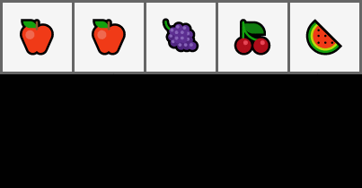
```go
fruits := []string{"🍎", "🍎", "🍇", "🍒", "🍉"}
apples := fruits[:2]

apples[0] = "🍏"
apples[1] = "🍏"
 
apples // [🍏 🍏]
fruits // [🍏 🍏 🍇 🍒 🍉]


```


### copy

`copy` bir sliceı aynı veya daha büyük kapasiteye sahip bir diğer slicea kopyalamamızı sağlar ve  kaç adet elemanın kopyalandığını döndürür.

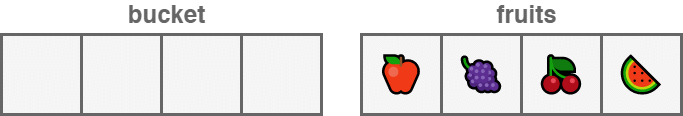

```go
bucket := make([]string, 5)

fruits := []string{"🍎", "🍇", "🍒", "🍉"}

n_copied := copy(bucket, fruits)

n_copied // 5
bucket // [🍎 🍇 🍈 🍉]

```

Bir slice kopyalanırken, elemanlar hedef slicedaki aynı indexdeki elemanların yerini alır.


```go
fruits := []string{"🍇", "🍒", "🍉"}
apples := []string{"🍎", "",  "🍏"}

copy(fruits, apples)

fruits // [🍎  🍏]

```

### filter

Slice elemanlarını belirli bir kritere göre filtreleyebiliriz.

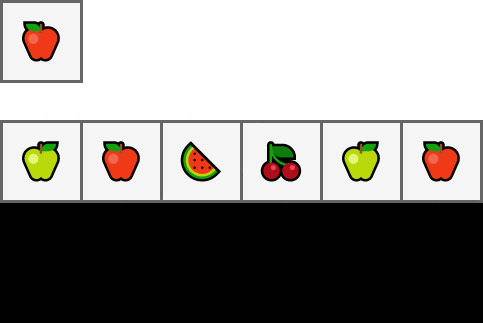

```go
fruits := []string{"🍏", "🍎", "🍉", "🍏", "🍎"}
apple_criteria := "🍎"

apples := []string{}
for _, fruit := range fruits {
	if fruit == apple_criteria {
		apples = append(apples, fruit)
	}
}

apples // [🍎 🍎]
```


### append

`append` fonksiyonu, ilk parametre olarak boyutunu artıracağımız sliceı ve devamında ekleyeceğimiz elemanları alır ve bize tüm elemanları içeren **yeni** bir slice döndürür. Bu nedenle, dönüş değerini bir değişkende\(genellikle eski slice değişkeninde\) tutmak gerekir.


```go
bucket := []string{"🍎", "🍇", "🍒", "🍉"}

green_apple := "🍏"
bucket = append(bucket, green_apple)

bucket // [🍎 🍇 🍒 🍉 🍏]
```


### pop

Aşağıdaki örnekte sliceın son elemanını çıkarıp bir değişkene atadık.

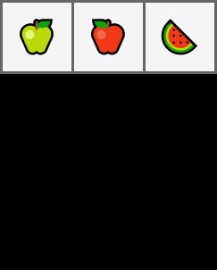

```go
fruits := []string{"🍏", "🍎", "🍉"}

item, fruits := fruits[len(fruits)-1], fruits[:len(fruits)-1]

item // 🍉
fruits // [🍏 🍎]
```


### push front (unshift)

Bu örnekte yeni bir elemanı sliceın başına koyduk.

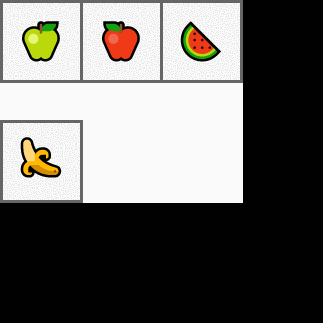

```go
fruits := []string{"🍏", "🍎", "🍉"}
banana := "🍌"

fruits = append([]string{banana}, fruits...)

fruits // [🍌 🍏 🍎 🍉]
```


### pop front (shift)

Bu örnekte de sliceın ilk elemanını çıkarıp bir değişkene atadık.

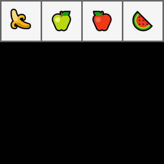

```go
fruits := []string{"🍌", "🍏", "🍎", "🍉"}

banana, fruits := fruits[0], fruits[1:]

banana // 🍌
fruits // [🍏 🍎 🍉]
```


### insert

Sliceın herhangi bir kısmına yeni bir eleman eklemek istiyorsak; bu yöntemleri kullanabiliriz.

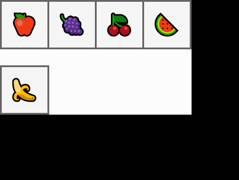

```go
fruits := []string{"🍎", "🍇", "🍒", "🍉"}
banana := "🍌"
insert_index := 2

fruits = append(
	fruits[:insert_index],
	append([]string{banana}, fruits[insert_index:]...)...,
)

fruits  // [🍎 🍇 🍌 🍒 🍉]
```

`append([]string{banana}, fruits[insert_index:]...)` ifadesi başlı başına bir slice oluşturup, `fruits[insert_index:]` sliceının elemanlarını bu slicea kopyalıyor. Bu elemanlar daha sonra `fruits` sliceına tekrar kopyalanıyor.

Yeni bir slice oluşturulmasının ve 2. kez kopyalama işleminin önüne geçilebilir.


```go
fruits := []string{"🍏", "🍎", "🍉"}
banana := "🍌"
insert_index := 2

fruits = append(fruits, "")
copy(fruits[insert_index+1:], fruits[insert_index:])
fruits[insert_index] = banana

fruits // [🍏 🍎 🍌 🍉]
```


### expand

Bir sliceı, diğeri birleştirmek istersek aşağıdaki yöntemleri kullanabiliriz.

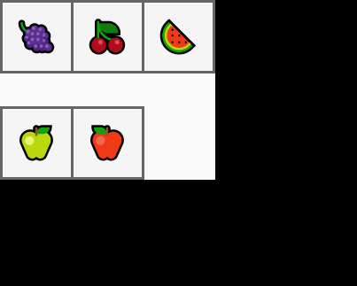

```go
bucket := []string{"🍇", "🍒", "🍉"}
apples := []string{"🍏", "🍎"}

bucket = append(bucket, apples...)

bucket // [🍇 🍒 🍉 🍏 🍎]
```

Aşağıdaki örnekte `7.` satırda `apples` ile belirlediğimiz indexten sonraki elemanları birleştirdik. Sonrasında belirlediğimiz indexe kadar olan `bucket` elemanlarına, bu slice elemanlarını ekledik.

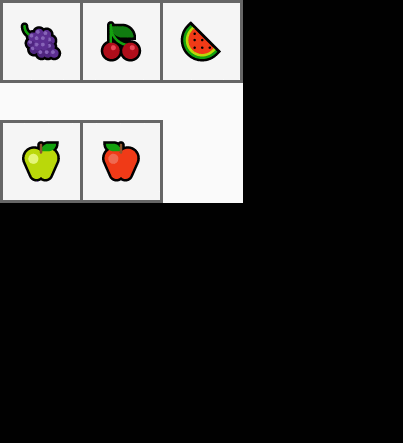

```go
bucket := []string{"🍇", "🍒", "🍉"}
apples := []string{"🍏", "🍎"}
expand_index := 2

bucket = append(
    bucket [:expand_index]
    append(apples, bucket[expand_index:]...)...,
)

bucket // [🍇 🍒 🍏 🍎 🍉]
```

### cut

Slicedaki belli bir aralığı çıkarmak istiyorsak aşağıdaki yöntemi kullanabiliriz. Bu yöntem Sliceda belirlediğimiz başlangıç indexine kadar olan elemanlar ile bitiş indexinden sonraki elemanları ekleyecek. Böylece aradaki elemanları boşa çıkartmış olacağız.


```go
edibles := []string{"🍎", "🍇", "🍒", "🍉", "🌶", "🍆", "🌽", "🥔"}

cut_start_index, cut_end_index := 4, 6
 
edibles = append(edibles[:cut_start_index], edibles[cut_end_index:]...)

edibles // [🍎 🍇 🍒 🍉 🌽 🥔]
```


### cut (memory safe)
Bellek adresi tutan slicelar üzerinde işlem yapmak memory-leak oluşturabilir. 

Aşağıdaki örneklerde yaptığımız işlemlere ek olarak, işlemimden sonra boşta kalan alanları **nil** değerleri ile doldurduk. Böylece, garbage-collector bu alanların artık kullanılmayacağını anlayabilir ve onları sisteme geri kazandırabilir.


```go
apple, grapes, cherry, wmelon := "🍎", "🍇", "🍒", "🍉"
pepper, egplnt, corn, potato := "🌶", "🍆", "🌽", "🥔"
edibles := []*string{&apple, &grapes, &cherry, &wmelon, &pepper, &egplnt, &corn, &potato}

cut_start_index, cut_end_index := 4, 6

copy(edibles[cut_start_index:], edibles[cut_end_index:])

cleanup_index := len(edibles) - cut_end_index + cut_start_index

for free_index, free_end := cleanup_index, len(edibles); free_index < free_end; free_index++ {
	edibles[free_index] = nil
}

edibles = edibles[:cleanup_index]

edibles // [🍎 🍇 🍒 🍉 🌽 🥔]
```


### delete

Slicedaki bir elemanı indexini kullanarak silmek istiyorsak, aşağıdaki yöntemi kullanabiliriz.


```go
edibles := []string{"🍎", "🍇", "🍒", "🍉", "🌶", "🍆", "🌽", "🥔"}

index_of_cherry := 2
edibles = append(edibles[:index_of_cherry], edibles[index_of_cherry + 1:]...)

edibles // [🍎 🍇 🍉 🌶 🍆 🌽 🥔]
```

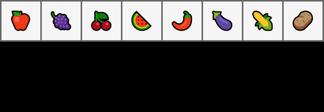


#### Sıralamayı Dikkate Almadan Silme

Silme işlemini array sıralamasını göz ardı ederek de yapabiliriz. Aşağıdaki örnekte, silmek istediğimiz eleman ile slicedaki en son elemanın yerini değiştirdik. Ardından sliceın boyutunu 1 azalttık.

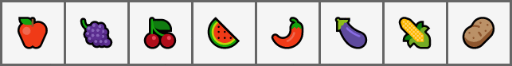

```go
edibles := []string{"🍎", "🍇", "🍒", "🍉", "🌶", "🍆", "🌽", "🥔"}
index_of_cherry := 2

edibles[index_of_cherry] = edibles[len(edibles)-1]
edibles = edibles[:len(edibles)-1]

edibles // [🍎 🍇 🥔 🍉 🌶 🍆 🌽]
```


Map
--------


En sık kullanılan veri tiplerinden birisi de maplerdir. `map` unique anahtarları, değerlerle eşleştirebilen sonrasında bu anahtarla eşleştirilen değere erişilmesini sağlayan yapılardır. 

### Tanımlama

Mapler `map[AnahtarTipi]DeğerTipi` veya `make(map[AnahtarTipi]DeğerTipi)`şeklinde tanımlanabilir.

```go
var mymap = map[string]string{}
```

```go
mymap = make(map[string]string)
```

### Değer Atama


```go
monty_python_films_by_year := map[string]string{
	"1971": "Monty Python and the Holy Grail",
	"1979": "Life of Brian",
}

monty_python_films_by_year["1983"] = "The Meaning of Life"
```


Atadığımız değerlere, yine aynı keyi kullanarak erişebiliriz.


```go
film_name := monty_python_films_by_year["1983"]

film_name // The Meaning of Life
```


> Mapin bir elemanına erişirken, elemanın mapde kayıtlı olup olmadığını gösteren ek bir değere daha erişebiliriz.


```go
film_name, registered := monty_python_films_by_year["2019"]

if !registered {
	fmt.Println("Monty python did not relase a film at 2019")
} else {
	fmt.Println(film_name)
}
```

### Döngü ile kullanma

Map elemanlarına temelde 2 yolla erişilebilir.

1. For döngüsünde tek değişken kullanıp, keyler üzerinden erişerek.


```go
monty_python_films_by_year := map[string]string{
	"1971": "Monty Python and the Holy Grail",
	"1979": "Life of Brian",
	"1983": "The Meaning of Life",
}

for year := range monty_python_films_by_year {
	film_name := monty_python_films_by_year[year]
	fmt.Println(film_name, "was released at", year)
}
```


2. Döngüde 2 değişken kullanıp, hem anahtar hem de değere erişerek.


```go
for year, film_name := range monty_python_films_by_year {
	fmt.Println(film_name, "was released at", year)
}

/*
Monty Python and the Holy Grail was released at 1971
Life of Brian was released at 1979
The Meaning of Life was released at 1983
*/
```


### delete

Mapdeki bir elemanı silmek için delete fonksiyonunu kullanabiliriz.


```go
monty_python_films_by_year := map[string]string{
	"1971": "Monty Python and the Holy Grail",
	"2016": "Batman v Superman",
}

delete(monty_python_films_by_year, "2016")
_, registered := monty_python_films_by_year["2016"]

registered // false

len(monty_python_films_by_year) // 1
```


struct
-------------

Structlar kullanıcı tarafından tanımlanan ve farklı türdeki verileri isimleri ile tutabilen veri yapılarıdır.

### Tanımlama

Structlar aşağıdaki yapıda tanımlanabilir.

```go
type StructName struct{
    field fieldType
}
```

Structın aynı tipteki alanlarını tek satırda tanımlayabiliriz.


```go
type Film struct {
	name, director string
	imdb           float32
	release_year   int
}
```


```go
var new_film = Film{}

new_film // {"" "" 0 0}
```


Struct alanlarına ek olarak etiket de verebiliriz.


```go
type Film struct {
	Name        string  `json:"film_name"`
	Director    string  `json:"director_name"`
	Imdb        float32 `json:"imdb_score"`
	ReleaseYear int     `json:"year_of_release"`
}
```


Etiketler tip dönüşümü ile çokça uğraşan ORMler ve serialization kütüphaneleri arasında popülerdir. Bu etiketlere `reflect` modülü ile erişilebilir.


```go
f := Film{}
t := reflect.TypeOf(f)
for _, f := range []string{"Name", "Director", "Imdb", "ReleaseYear"} {
	field, found := t.FieldByName(f)
	if !found {
		continue
	}
	fmt.Println(field.Tag.Get("json"))
}

/*
film_name
director_name
imdb_score
year_of_release
*/
```


### Değer Atama

Bir struct, parametreleri sırasıyla verilerek oluşturulabilir.


```go
new_film := Film{"Mad Max: Fury Road", "George Miller", 8.1, 2015}

new_film // {Mad Max: Fury Road George Miller 8.1 2015}
```


Benzer biçimde,  parametreleri ve alacakları değerleri `:` ayracı ile belirterek de oluşturulabilir.


```go
new_film := Film{
		Name:        "Ran",
		Director:    "Akira Kurosawa",
		Imdb:        8.2,
		ReleaseYear: 1985,
}

new_film // {Ran Akira Kurosawa 8.2 1985}
```


Struct oluştururken bazı alanlar boş bırakılırsa; bu alanlar o veri tipinin boş değerleri ile tanımlanır.


```go
new_film := Film{
	name:         "Batman v Superman",
	director:     "Zack Snyder",
	release_year: 2016,
}

new_film // {Batman v Superman Zack Snyder 0 2016}
```


#### Anonymous struct

Bazı özel durumlarda structları fonksiyon gövdesi içerisinde tanımlamamız gerekebilir. Bunu aşağıdaki yöntemle yapabiliriz.


```go
provider_config := struct {
	name    string
	baseUrl string
	apiKey  string
}{
	name:    "mapbox",
	baseUrl: "https://api.mapbox.com/geocoding/v5/",
	apiKey:  "123asds123",
}

provider_config // {mapbox https://api.mapbox.com/geocoding/v5/ 123asds123}
```


#### Anonymous fields

Alan isimlerini belirtilmeden de struct tanımlanabilir. Bu tarz bir tanımlamada belirtilen veri tiplerinin birbirinden farklı olması gerekir.


```go
type Item struct {
	string  // code
	int     // quantity
	float32 // price
}

item := Item{
	"child-seat-1",
	5,
	20.1,
}

item // {child-seat 5 20.1}
```

#### Promoted fields

Bir struct başka bir struct içerisinde alan ismi verilmeden kullanılabilir. Bu durumda içerideki structa kendi ismiyle erişilir. Aşağıdaki örneği baz alırsak `Page` içerisindeki `Content`e `page.Content` şeklinde erişilebilir.


```go
type Content struct {
	body string
	size int
}

type Page struct {
	nextUrl     string
	previousURL string
	Content
}
```


```go
content := Content{
	body: "<h1>Hi</h1>",
	size: 11,
}

page := Page{
	nextUrl:     "http://.../3",
	previousURL: "http://.../1",
	Content:     content,
}

page // {http://.../3 http://.../1 {<h1>Hi</h1> 11}}

page.Content // {<h1>Hi</h1> 11}
```


## Pointer

Pointer bir başka değişkenin memory adresini tutan bir değişkendir.  
  
Çalışma esnasında yeni bir nesne oluşturulduğunda, bu nesneyi hafızada tutmamız gerekir. Nesne için hafızada ayrılan alanın yerini değişkenler ile tutarız.

### Tanımlama

Pointer da değişkenlerdir. Diğer değişkenlerden farkı herhangi bir veriyi değil, o verinin yerini belirten değişkenin adresini tutmasıdır.

Pointerlar `var pointer *Type` yapısı kullanılarak tanımlanır. Değer atanmadığı takdirde pointerin değeri `nil` olarak belirlenir.

```go
var ptr *int
ptr // nil
```

Pointerları `new` fonksiyonunu kullanarak da tanımlayabiliriz.

```go
ptr := new(int)
ptr // nil
```

### Değer Atama

Pointera `&` işaretini kullanarak, bir başka değişlenin adresini, değer olarak atayabiliriz. 

`*` işareti ile pointeri kullanarak, işaret ettiği değişkene\(dolayısıyla tutulan veriye\) erişebiliriz.


```go
var carbon string = "Carbon"
var ptrCarbon *string

ptrCarbon = &carbon

ptrCarbon // 0xc000092030
*ptrCarbon // "Carbon"

*ptrCarbon = "Altered " + *ptrCarbon

carbon // "Altered Carbon"
```


## Fonksiyonlar

Genel olarak GO'da fonksiyonlar aşağıdaki yapıda tanımlanır.

```go
func fonksiyon_adı( [parametre listesi] ) [dönüş değerlerinin tipleri]
{
   fonksiyon gövdesi
}
```


```go
func sigmoid(value float64) float64 {
	return 1.0 / (1.0 + math.Exp(-value))
}

sigmoid(0.5) // 0.62246
```

### Parametreler

GO fonksiyonlarına parametre olarak girilen değişkenler kopyalanır. Bu nedenle parametreler üzerinde yapılan değişiklikler değişkenlerin fonksiyon dışındaki durumlarını etkilemez.

```go
type Wallet struct {
	userID  int
	balance float64
	deposit float64
}

func withdraw(wallet Wallet, amount float64) {
	wallet.balance -= amount
}
```

Yukarıdaki kodda basitçe bir cüzdan yapısı ve bu cüzdandan para çekebilen `withdraw` fonksiyonu tanımladık. Aşağıdaki satırlarda da bir adet cüzdan oluşturup bu fonksiyon ile kullandık.


```go
wallet := Wallet{
	userID:  1,
	balance: 30000.12,
	deposit: 40000.01,
}

item_price := 10023.0
withdraw(wallet, item_price)

wallet.balance // 3000.12
```


Görüldüğü üzere cüzdandaki para değişmedi. Bu tarz kazaları 2 yolla önleyebiliriz.

1. Yöntem, cüzdandaki son para durumunu döndürüp, cüzdanı sonradan güncelleyebiliriz.


```go
func withdraw(wallet Wallet, amount float64) float64 {
	new_balance := wallet.balance - amount
	return new_balance
}

wallet.balance = withdraw(wallet, item_price)
wallet.balance // 19977.12
```


Bu değişim, işi _cüzdandan para çekmek_ olan withdraw fonksiyonunun kullanım amacını değiştirmiş oluyor.

2. Yöntem, cüzdan değişkeni yerine, cüzdanın adresini parametre olarak verebiliriz.


```go
func withdraw(wallet *Wallet, amount float64) {
	wallet.balance -= amount
}

withdraw(&wallet, item_price)

wallet.balance // 19977.12
```


Bu yöntemin dezavantajı da farklı concurrency safe olmamasıdır. Farklı threadler ile cüzdandan para çekmek istediğimizde, bakiye durumunu takip etmek zor olacaktır.

#### Dinamik parametreler

GO fonksiyonlarında dinamik parametreler tanımlanabilir. Bu türdeki parametreleri tanımlamak için parametre tipinin önüne `...` işareti yazılır.


```go
func ReLU(nums ...float64) []float64 {
	new_nums := make([]float64, len(nums))
	for idx, value := range nums {
		if value > 0 {
			new_nums[idx] = value
		} else {
			new_nums[idx] = 0.
		}
	}
	return new_nums
}
```


```go
nums := []float64{1., 0.2, 0., 0., -0.1, 0.1}

nums = ReLU(nums...)

nums // [1 0.2 0 0 0 0.1]
```


### Dönüş Değerleri

#### Birden fazla değer döndürme

GO fonksiyonlarında birden fazla değer döndürülebilir. Dönülecek değerleri `()` arasında sırasıyla tanımlamak gerekmektedir.


```go
func swap(first_arg, second_arg string) (string, string) {
   return second_arg, first_arg
}
```


```go
var language1, language2 string = "Python", "GO"

language1, language2 = swap(language1, language2)

language1, language2 // GO Python
```


#### Dönüş değerlerini isimlendirme

Fonksiyonların dönüş değerlerine isim verip, değerleri bu değişkenler ile belirleyebiliriz. İsimlendirilmiş dönüş değerleri veri tipinin boş değerini alacağı için, fonksiyonun ön tanımlı dönüş değerleri olarak da kullanılabilirler.


```go
type Record struct {
	id   int
	data string
}
type DB struct {
	records []Record
	locked  bool
}

func BulkCreate(records []Record, db *DB) (n_created int, err error) {
	if db.locked {
		err = errors.New("DB is locked")

	} else {
		db.records = append(db.records, records...)
		n_created = len(records)
	}
	return n_created, err
}
```


```go
db := &DB{
	records: []Record{},
	locked:  true,
}

data := []Record{}

for i := 0; i < 100; i++ {
	rec := Record{
		id:   i,
		data: "test",
	}
	data = append(data, rec)
}
n_created, err := BulkCreate(data, db)
if err != nil {
	fmt.Println(err)
}
```

### Anonim Fonksiyon

GO'da fonksiyonlar da veri yapılarıdır ve diğer fonksiyonların içerisinde tanımlanabilirler. Anonim fonksiyonları, projenin kısıtlı bir bölümünde, spesifik bir işi halletmek için kullanabiliriz.

Aşağıdaki kod örneğinde, projenin başka yerinde bu işleme ihtiyaç duymayacağımızı varsayarak, bir sliceı belirlenen boyutta parçalayan bir anonim fonksiyon kullandık.


```go
records := []int{0, 1, 2, 3, 4, 5, 6, 7, 8, 9}
batchSize := 3

batchedRecords := func(data []int, batchSize int) [][]int {
	var batches [][]int

	for batchSize < len(data) {
		data, batches = data[batchSize:], append(batches, data[0:batchSize:batchSize])
	}
	batches = append(batches, data)
	return batches
}(records, batchSize)

batchedRecords // [[0 1 2] [3 4 5] [6 7 8] [9]]
```

Bu türdeki fonksiyonları bir değişkene atayıp bir kaç kez de kullanabiliriz.

Aşağıdaki örnekte spesifik bir APIden ayrı ayrı gönderilen ülke kodu ve telefon numaralarını değişken olarak tanımladığımız fonksiyonla birleştirdik.


```go
type Vendor struct {
	name        string
	countryCode string
	phone       string
}

vendor := Vendor{
	name:        "Volswagen Group",
	countryCode: "1",
	phone:       "403120120",
}

formatPhoneNumbers := func(contact Vendor) string {
	return "+" + contact.countryCode + contact.phone
}

formatPhoneNumbers(vendor) // +1403120120
```


## Metodlar

GO dilinde diğer nesne yönelimli programlama dilleri gibi classlar ve kalıtım yoktur. Fakat fonksiyonlara `receiver` denilen ek bir argüman ekleyerek ile kendi oluşturduğumuz tiplere fonksiyonları bağlayabiliriz. Böylece GO dilinde de nesne yönelimli programlamaya benzer bir deneyim yakalanabilir.


```go
type Connection struct {
	host     string
	port     int
	timeOut  int
	isClosed bool
}

func (conn *Connection) Close() {
	conn.isClosed = true
	fmt.Println("Connection", conn.host+":"+strconv.Itoa(conn.port), "closed.")
}
```


Yukarıdaki yapıda `Close` fonksiyonuna normal bir fonksiyona ek olarak `(conn *Connection)` kısmını ekledik. Böylece aşağıdaki örnekte görüldüğü gibi `c.Close()`  şeklinde`Connection` tipi üzerinden fonksiyona erişebildik.


```go
c := Connection{
    host:     "0.0.0.0",
    port:     8080,
    timeOut:  1,
    isClosed: false,
}
c.Close() // Connection 0.0.0.0:8080 closed.
```


> #### Pointer receiver \| Value receiver
>
> Fonksiyon parametrelerinde olduğu gibi receiverlerde de yapının değeri ile mi yoksa memory adresi ile mi kullanılacağına karar verilmelidir.
>
> Receiverları struct dışındaki tipler için de kullanabiliriz.


```go
type Iterable []int

func (iterable *Iterable) Append(items ...int) {
	*iterable = append(*iterable, items...)
}

arr := Iterable{1, 2}
arr.Append(4, 5, 6)

arr // [1 2 4 5 6]
```


## Error

GOda kendi hata tiplerimizi oluşturabiliriz. Bunun için oluşturduğumuz tipin sadece Error methoduna sahip olması yeterlidir.

### Tanımlama

Aşağıdaki örnekte HTTP kodunu ve hata nedenini belirten `HTTPError` adında yeni bir hata tanımladık.


```go
type HTTPError struct {
	Status int
	Reason string
}

func (e HTTPError) Error() string {
	return fmt.Sprintf("%v: %v", e.Status, e.Reason)
}

func MakeRequest() error {
	return HTTPError{
		Status: 400,
		Reason: "Bad Request",
	}
}
```


### Kullanım

Fonksiyon çalıştırıldığında dönülen hata değerinin `nil` olup olmadığı kontrol edilerek buna göre önlemler alınabilir.


```go
err := MakeRequest()
if err != nil {
	fmt.Println(err)
}
```


## Interface

Interfaceler bir objenin sahip olabileceği methodları belirten yapılardır. Bu nedenle interfaceler objelerin davranışını ifade eder. Örneğin; bir dosyandan veri okunabilir veya dosyaya veri yazılabilir. Bir interface okuma ve yazma methodlarını barındırıyorsa ve dosya objesi bu methodlara sahipse dosyanın bu interfacei `implement` ettiği söylenebilir.

Interfacelerin asıl amacı methodları, aldıkları parametreleri ve dönüş değerlerini genel bir şekilde tanımlayarak; aynı davranışı gösteren, fakat farklı işlerde kullanılan yapılar için ortak bir protokol oluşturmaktır.

### Tanımlama

GO dilinde interfaceler objelerle _kapalı_ halde uygulanır. Başka bir deyişle; bir tipin bir interfacei kullandığını belirtmek için, diğer çoğu nesne yönelimli dillerde olduğu gibi,`class File implements IO` gibi deyimler kullanmamız gerekmez. GO aynı metodları paylaşan interface ve tipler arasındaki ilişkiyi kendisi kurar.


```go
type IOInterface interface {
	Read() []byte
	Write([]byte) int
}

type File struct {
	name    string
	content []byte
}

func (file *File) Read() []byte {
	return file.content
}

func (file *File) Write(content []byte) int {
	file.content = append(file.content, content...)
	return len(content)
}

type Socket struct {
	ip     string
	port   int
	buffer []byte
}

func (sock *Socket) Read() []byte {
	return sock.buffer
}

func (sock *Socket) Write(stream []byte) int {
	sock.buffer = append(sock.buffer, stream...)
	return len(stream)
}
```


```go
file := File{
	name: "test",
}
sock := Socket{
	ip:   "0.0.0.0",
	port: 21,
}

data := []byte("data")
file.Write(data)

sock.Write(file.Read())

string(sock.Read() // "data"
```


Yukarıdaki uygulamada `Read` ve `Write` metodlarını tanımlayan `IOInterface` interfaceini ve bu methodlara sahip`File` ve `Socket` tiplerini tanımladık.

### Kullanım

Aşağıdaki örnekte `Log` methodu `IOInterface` interfaceini parametre olarak aldığı için hangi veri tipinden geldiğini önemsemeden veriyi okuyup, işini yapabilir.


```go
type Logger struct {
}

func (log *Logger) Log(io IOInterface) {
	for _, data := range io.Read() {
		fmt.Print(string(data))
	}
	fmt.Println()
}
```


```go
file := &File{
	name: "test",
}
sock := &Socket{
	ip:   "0.0.0.0",
	port: 21,
}
logger := Logger{}

data := []byte("data")

file.Write(data)
sock.Write(file.Read())

logger.Log(file) // "data"
logger.Log(sock) // "data"
```


### Birden Fazla interface kullanma

GO tipleri birden fazla interfacei implement edebilir. Bunun için interfacein belirttiği metodlara sahip olmaları yeterlidir.  


```go
type Reader interface {
	Read() []byte
}

type Writer interface {
	Write([]byte) int
}

type File struct {
	name    string
	content []byte
}

func (file *File) Read() []byte {
	return file.content
}

func (file *File) Write(content []byte) int {
	file.content = append(file.content, content...)
	return len(content)
}

```


```go
var file Reader = &File{
	name:    "test",
	content: []byte("data"),
}
var sock Writer = &Socket{
	ip:   "0.0.0.0",
	port: 21,
}

sock.Write(file.Read())

sock.buffer // sock.buffer undefined (type Writer has no field or method buffer
```

### Tip dönüşümü


```go
s := sock.(*Socket)
string(s.buffer) // "data"
```


> Dönüştürdüğümüz tipin o interfacei doğru bir şekilde implement edip etmediğini dönüşüm sırasında alacağımız ek bir parametre ile kontrol edebiliriz.


```go
type Serializer interface {
	Serialize()
}

s, ok := sock.(Serializer)
s, ok // nil, false
```


### Boş interface

Interfaceler de diğer veri yapıları gibi tiplerdir ve aynı şekilde kullanılabilir. GO projelerinde boş interface; `interface{}` şeklinde tanımlanır. 

Hiçbir metodu olmadığı için boş interfacein gereksinimleri bütün tipler tarafından karşılanır. boş interfacein bu özelliği, dinamik parametreler ve değerler tanımlamamıza olanak tanır.


```go
type Booking struct {
	Provider            string
	CustomerID          string
	ExtraProviderParams interface{}
}
```


```go
booking1 := Booking{
	Provider:   "ACL",
	CustomerID: "customer-01a",
	ExtraProviderParams: map[string]interface{}{
		"Passengers":  4,
		"PaymentTime": "after-booking",
	},
}

booking2 := Booking{
	Provider:   "DCM",
	CustomerID: "customer-03f",
	ExtraProviderParams: []interface{}{
		4, "after-booking",
	},
}

booking1 // {ACL customer-01a map[Passengers:4 PaymentTime:after-booking]}
booking2 // {DCM customer-01a [4 after-booking]}
```


### Tip Kontrolü

Interface tipleri `switch` yapısı ile kontrol edilebilir. Aşağıdaki örnekte `Stringify` fonksiyonu`interface{}` tipinde parametre olarak alarak farklı veri tiplerini fonksiyonda kullanmamıza olanak sağlıyor. 

Bu fonksiyonda int string ve float gelen değerleri tiplerine göre kontrol edip belirlediğimiz şekilde stringe çevireceğiz.


```go
func Stringify(value interface{}) (string, error) {
	switch value.(type) {
	case string:
		return value.(string), nil
	case float32, float64:
		return fmt.Sprintf("%.2f", value), nil
	case int:
		return fmt.Sprintf("%d", value), nil
	default:
		return "", errors.New("Invalid type")
	}
}

Stringify(12) // "12"
Stringify(12.52312313) // "12.52"
Stringify("test")  // "test"
```
